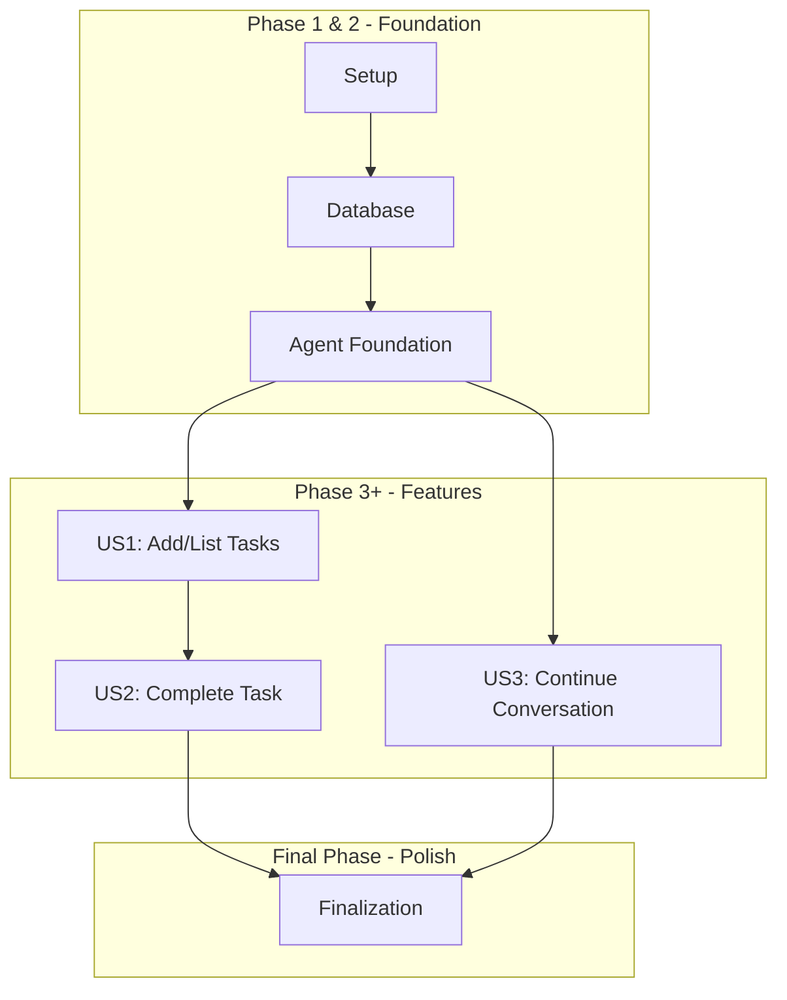

# Tasks: Phase III AI Chat Backend

This document breaks down the implementation of the AI Chat Backend into atomic, executable tasks for an AI agent.

## Dependencies

The implementation will be phased, with each user story building upon the foundational setup.

## Implementation Strategy

The project will be implemented in phases, prioritizing the core user journey (US1) to deliver a viable MVP as quickly as possible. Each user story is designed to be an independently testable and deployable unit of functionality.

---

## Phase 1: Environment & Configuration

- [X] T001 Update `backend/requirements.txt` to add the `openai` library.
- [X] T002 Update `backend/src/core/config.py` to load the `OPENAI_API_KEY` from environment variables.

## Phase 2: Foundational Backend

- [X] T003 [P] Create the directory structure for the new agent modules: `backend/src/api/v1/`, `backend/src/models/`, `backend/src/services/`, `backend/src/agent/`.
- [X] T004 Create `backend/src/models/chat.py` and implement the `Conversation` and `Message` SQLModel classes as defined in `data-model.md`.
- [X] T005 Add logic to `backend/src/main.py` to create database tables on startup.
- [X] T006 Create `backend/src/agent/assistant.py` and implement the logic to create or load the OpenAI Assistant.
- [X] T007 Create the initial `backend/src/agent/skills.py` file with placeholder functions for the task management tools.

## Phase 3: User Story 1 - Add and List Tasks

**Goal**: A user can create and list tasks by chatting with the agent.
**Independent Test**: API calls to the chat endpoint with "add task..." and "list tasks" result in correct database changes and conversational responses.

- [X] T008 [US1] [P] In `backend/src/agent/skills.py`, implement the full logic for the `add_task` and `list_tasks` skills, ensuring they call the existing task service layer.
- [X] T009 [US1] Create `backend/src/services/chat_service.py` and implement the core `handle_chat_message` function to orchestrate the agent interaction, including the tool-calling loop.
- [X] T010 [US1] Create `backend/src/api/v1/chat.py` and implement the `POST /api/v1/chat` endpoint, protecting it with the `get_current_user` dependency.
- [X] T011 [US1] Update `backend/src/main.py` to include the router from `backend/src/api/v1/chat.py`.

## Phase 4: User Story 2 - Complete a Task

**Goal**: A user can complete or delete tasks via chat.
**Independent Test**: After creating a task, a user can send a message like "complete the first task" and verify the task's `is_completed` status is updated.

- [X] T012 [US2] In `backend/src/agent/skills.py`, implement the logic for the `update_task` and `delete_task` skills.

## Phase 5: User Story 3 - Continue a Conversation

**Goal**: A user can continue a conversation from a previous session.
**Independent Test**: Make one API call, then make a second call passing the `conversation_id` from the first response, and verify the agent's response is context-aware.

- [X] T013 [US3] In `backend/src/services/chat_service.py`, enhance the `handle_chat_message` function to correctly load an existing `Conversation` and its corresponding OpenAI `Thread ID` when a `conversation_id` is provided in the request.

## Phase 6: Polish & Finalization

- [X] T014 [P] Implement comprehensive, user-friendly error handling within the `chat_service.py` and the API endpoint in `chat.py`.
- [X] T015 [P] Add structured logging throughout the chat service and agent skills to provide clear traceability for each request.
- [ ] T016 [P] Write unit tests for the chat service layer in `backend/tests/unit/`, mocking external API calls to OpenAI.
- [ ] T017 Write an integration test for the chat API endpoint in `backend/tests/integration/` that covers a multi-turn conversation.

---
This task breakdown enables spec-driven, agentic backend implementation.
